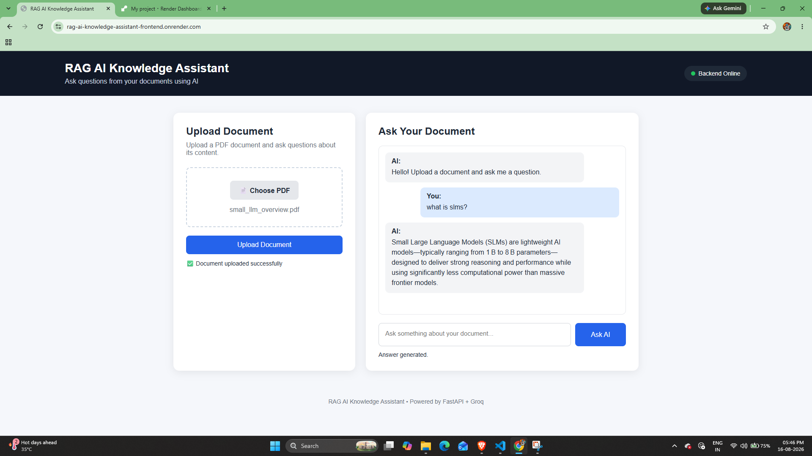

# 🤖 RAG AI Knowledge Assistant



An AI-powered Retrieval-Augmented Generation (RAG) application that allows users to upload PDF documents and ask questions about their content.

The system retrieves relevant information from uploaded documents using semantic search and generates answers using a local Large Language Model (LLM).

## 🚀 Features

- 📄 Upload PDF documents
- 🔍 Semantic document search
- 🧠 Retrieval-Augmented Generation (RAG)
- 💬 Ask questions about uploaded documents
- 🤖 Local LLM responses using Ollama
- 🗄️ Vector database for document embeddings
- ⚡ FastAPI backend
- 🌐 Web-based frontend
- 🔐 Answers generated using retrieved document context

## 🛠️ Tech Stack

### Backend
- Python
- FastAPI
- Uvicorn

### AI / RAG
- Retrieval-Augmented Generation (RAG)
- Text chunking
- Semantic search
- Text embeddings
- Vector database
- Ollama
- Large Language Models (LLMs)

### Frontend
- HTML
- CSS
- JavaScript

## 🏗️ Architecture

```text
User
  │
  ▼
Web Interface
  │
  ▼
FastAPI Backend
  │
  ├── PDF Processing
  │
  ├── Text Chunking
  │
  └── Embeddings
          │
          ▼
    Vector Database
          │
          ▼
   Relevant Context
          │
          ▼
      Ollama LLM
          │
          ▼
    Generated Answer

    ## 🔄 How It Works

PDF Document
↓
Text Extraction
↓
Text Chunking
↓
Text Embeddings
↓
Vector Database
↓
Semantic Search
↓
Relevant Context
↓
Ollama LLM
↓
Generated Answer